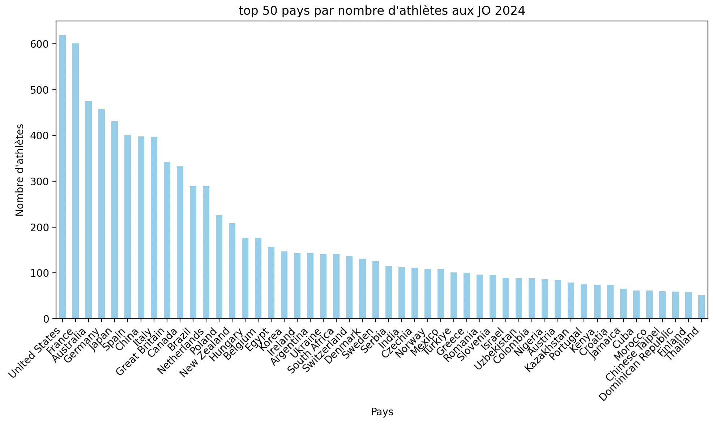
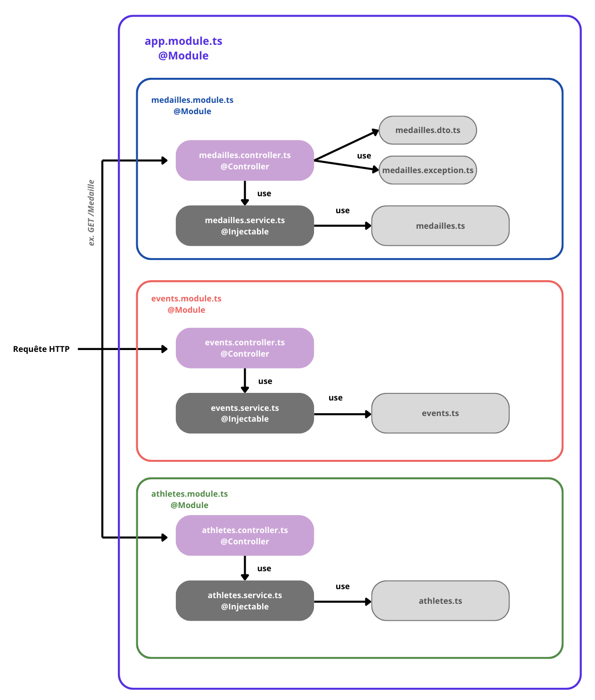

# JS_Olympics_API Readme


## Introduction 


En 2024, la France a accueilli l’un des plus grands événements sportifs mondiaux : les Jeux Olympiques d’été de Paris. Pendant plusieurs semaines, des milliers d’athlètes venus des quatre coins du globe se sont affrontés dans plus de 300 épreuves, réparties sur des dizaines de disciplines sportives. Cet événement a également permis  de générer une quantité massive de données : identités des athlètes, pays représentés, performances réalisées, épreuves disputées, palmarès de médailles, etc. Si ces données sont publiquement disponibles, elles sont souvent fragmentées, difficiles à interroger et peu centralisées sous un format accessible pour des développeurs, analystes ou journalistes sportifs qui souhaiteraient les réutiliser.  

Dans ce contexte, le Comité d’Organisation des Jeux de Paris 2024 a exprimé un besoin : **concevoir une API regroupant les données clés des JO** afin de faciliter leur consultation et leur exploitation dans d’autres projets (sites web, applications mobiles, visualisations de données, etc.).

<div align="center">
    
    <p><em>Figure 1 : Beach-volley Paris 2024</em></p>
</div>

Nous essaierons ainsi de répondre à la problématique suivante: 
> Comment centraliser et rendre accessibles les données massives des Jeux Olympiques de Paris 2024 de manière simple, rapide et structurée ?


<!-- --- -->

### Arborescence du projet & contexte
Ce projet a été réalisé dans le cadre d’un TP visant à concevoir une API REST en Node.js avec le framework NestJS. Cette dernière permet d’accéder aux données sous forme JSON et d’effectuer des requêtes sur chacune des entités à travers des endpoints REST.  
L’objectif est de manipuler des données issues des Jeux Olympiques d’été de Paris 2024 afin de s’initier à la création d’endpoints, à la structuration d’un projet backend et à la manipulation de fichiers de données.

```bash
├── data
│   ├── csv-2-json.py
│   ├── dataset_csv
│   │   ├── athletes.csv
│   │   ├── events.csv
│   │   ├── medals.csv
│   └── dataset_json
│       ├── athletes.json
│       ├── events.json
│       └── medals.json
├── node_modules
├── package-lock.json
├── package.json
├── README.md
├── src
│   ├── app.module.ts
│   ├── Athlete
│   │   ├── athlete.controller.ts
│   │   ├── athlete.module.ts
│   │   ├── athlete.service.ts
│   │   ├── Athlete.ts
│   │   ├── favorite.controller.ts
│   │   ├── favorite.module.ts
│   │   └── favorite.service.ts
│   ├── Events
│   │   ├── events.controller.ts
│   │   ├── events.module.ts
│   │   ├── events.service.ts
│   │   └── Events.ts
│   ├── main.ts
│   └── Medailles
│       ├── Medaille.ts
│       ├── medailles.controller.ts
│       ├── medailles.module.ts
│       └── medailles.service.ts
├── test
│   ├── athlete.e2e-spec.ts
│   ├── events.e2e-spec.ts.bak
│   └── medailles.e2e-spec.ts
└── tsconfig.json
```

## Quickstart

### Prérequis
Avant de commencer, assurez-vous d’avoir :

- Node.js (v18 ou plus récent)
- npm (livré avec Node.js)
- Un compte Clever Cloud pour le déploiement
- (Optionnel) NestJS CLI installé globalement : 
```bash
npm install -g @nestjs/cli
```

Cloner le repo puis installer les dépendances du projet
```bash
git clone https://github.com/ChloeLarroze/JS_Olympics_API.git
cd JS_Olympics_API
npm install
```
### Lancement de l'application

En local: 
```bash
npm run start:dev
```

Pour un build et un démarrage en production :
```bash
npm run build
npm run start:prod
```

### Déploiement sur Clever Cloud
TODO


Une fois l'API lancée, on pourra trouver les endpoints principaux :
- `/athletes`
- `/events`
- `/medailles`

<!-- --- -->


## Dataset utilisé 
Le dataset utilisé provient de [Paris 2024 Olympic Summer Games Dataset](https://www.kaggle.com/datasets/piterfm/paris-2024-olympic-summer-games).
Il fournit des informations complètes sur les Jeux Olympiques d’été 2024 : athlètes, disciplines, événements, pays participants, et médailles. 

Nous utiliserons notamment les tables: 
| Fichier          | Description                                                                 | Taille             |
|------------------|------------------------------------------------------------------------------|----------------------|
| `athletes.csv`   | Informations personnelles sur les athlètes (nom, âge, pays, sport, etc.)       | 11 113 athlètes       |
| `events.csv`     | Détails sur les épreuves (discipline, type, lieu, participants, etc.)          | 329 épreuves          |
| `medals.csv`     | Détenteurs de médailles (athlète, pays, épreuve, type de médaille)              | 1 044 médailles        |

Pour enrichir notre contexte, nous pourrons par exemple imaginer des statistiques, comme montré dans le graphe qui suit: 
<div align="center">
    
    <p><em>Figure : Répartition du nombre d'athlètes par pays</em></p>
</div>


#### Modèles de données JSON générés
À partir de ces fichiers CSV, nous avons ainsi généré des fichiers JSON dans le but de pouvoir utiliser ces données plus facilement (à la fois en terme de lecture que de rapidité d'accès depuis les endpoints). Nous avons pour cela utilisé le programme `csv-2-json.py` présent à titre anecdotique dans le repo. 
Les csv comportent de nombreuses informations que nous ne souhaitons pas forcément exploiter pour l'exemple de notre API. Par exemple, `athlete.csv` adopte la structure suivante: 

|code   |current|name          |name_short|name_tv       |gender|function|country_code|country|country_long|nationality|nationality_long|nationality_code|height|weight|disciplines  |events                    |birth_date|birth_place|birth_country|residence_place|residence_country|nickname|hobbies|occupation|education|family|lang    |coach|reason|hero|influence|philosophy                                                                              |sporting_relatives                                                                                          |ritual|other_sports|
|-------|-------|--------------|----------|--------------|------|--------|------------|-------|------------|-----------|----------------|----------------|------|------|-------------|--------------------------|----------|-----------|-------------|---------------|-----------------|--------|-------|----------|---------|------|--------|-----|------|----|---------|----------------------------------------------------------------------------------------|------------------------------------------------------------------------------------------------------------|------|------------|
|1532873|True   |AMOYAN Malkhas|AMOYAN M  |Malkhas AMOYAN|Male  |Athlete |ARM         |Armenia|Armenia     |Armenia    |Armenia         |ARM             |0.0   |0.0   |['Wrestling']|["Men's Greco-Roman 77kg"]|1999-01-22|YEREVAN    |Armenia      |YEREVAN        |Armenia          |        |       |          |         |      |Armenian|     |      |    |         |"To become a good athlete, you first have to be a good person." (ankakh.com, 6 Oct 2018)|Uncle, Roman Amoyan (wrestling), 2008 Olympic bronze medallist and two-time European champion in Greco-Roman|      |            |

Nous n'exploiterons cependant pas toutes ces données dans notre API mais ces dernières sont toujours ajoutables. De la même manière, nous structurerons les données de `events` dans la structure suivante. 

```json
{
      "event": "Men's Individual",
      "tag": "archery",
      "sport": {
        "name": "Archery",
        "code": "ARC",
        "url": "https://olympics.com/en/paris-2024/sports/archery"
      },
      "discipline": "Archery",
      "event_type": "Individual",
      "url_event": "/events/arc/men's-individual",
      "locations": [
        {
          "venue": "Esplanade des Invalides",
          "lat": 48.8584337,
          "lng": 2.3138998
        }
      ]
    }
```

#### Qualité de la donnée, remarques et problèmes
Comme dans tous les datasets, une petite phase de nettoyage a été nécessaire avant la conversion en JSON et la pleine exploitation des données. Nous avons pu observer : 
- une présence de valeurs `NaN` à de nombreux endroits, il faudra les remplacer par des `null`pour la fonction de parsage. 
- dans les genres des athlètes: les équipes mixtes sont marquées comme 'X'. Il faudra y faire attention lors de l'exploitation, par exemple du nombre de médailles remportées par des hommes par tel pays, etc. 
- certains events ou athlètes n'apparaissent pas dans la liste des médailles 
- Ex. Gregoria Mariska TUNJUNG a un type "Bronze Medal" mais pas de medal_code (devrait être 3) (l.471 de medals.csv)
 

<!-- --- -->

## API 
JSON, methods, details

<div align="center">
    
    <p><em>Figure 2 : Schéma API</em></p>
</div>

### Endpoints
#### Athlètes (/athletes)
GET /athletes - Liste tous les athlètes
GET /athletes/:id - Détails d'un athlète
PUT /athletes/:id - Mettre à jour un athlète (favori)
POST /athletes - Créer un athlète
GET /athletes/search?q=... - Recherche d'athlètes

#### Événements (/events)
GET /events - Liste tous les événements
GET /events/:id - Détails d'un événement
PUT /events/:id - Mettre à jour un événement (favori)
POST /events - Créer un événement
GET /events/search?q=... - Recherche d'événements

#### Médailles (/medals)
GET /medals - Classement des médailles par pays
GET /medals/:country - Médailles d'un pays spécifique

#### Recherche globale (/search)
GET /search?q=... - Recherche across toutes les données

### Configuration
#### Variables d'environnement
#### Configuration de la base de données
#### Configuration des CORS
#### Gestion des erreurs

<!-- --- -->

## Tests
### Structure des tests
### Exécution des tests
### Couverture de code


<!-- --- -->

## Déploiement
### Configuration Clever Cloud
### Variables d'environnement de production
### Pipeline de déploiement continu
### Monitoring et logs

<!-- --- -->
## Exemples d'Utilisation
link btw our context and the material produced 
### Requêtes API examples (avec curl et examples JSON)
### Réponses API examples
### Cas d'utilisation courants


<!-- 
description: "NEST JS API deployment project based on Paris 2024 Olympics dataset @ Mines St-Étienne"
author: "Alice Francé, Chloé Larroze"
 -->