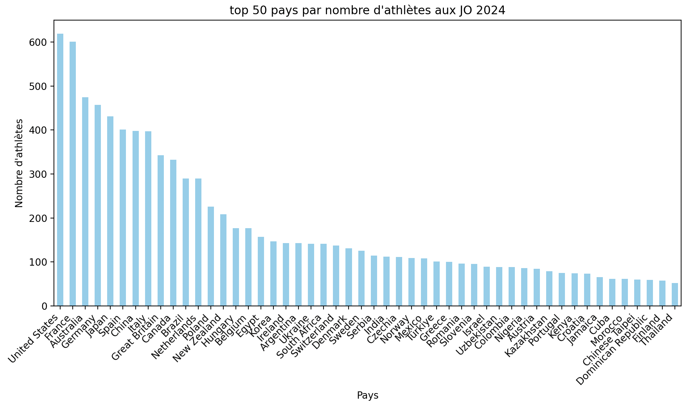
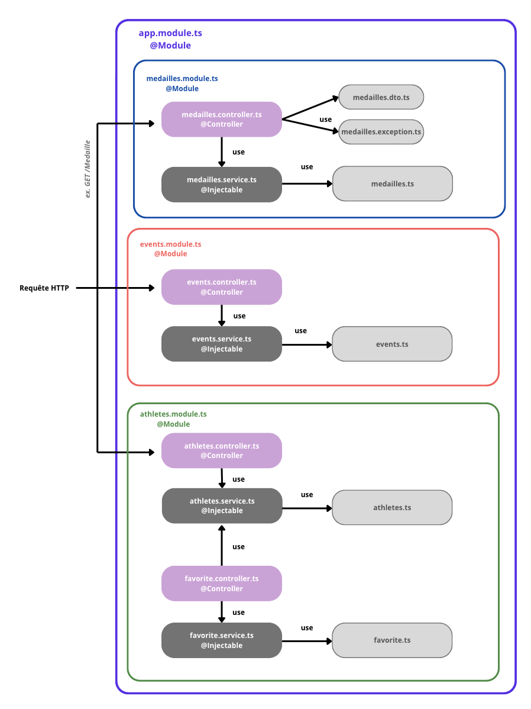
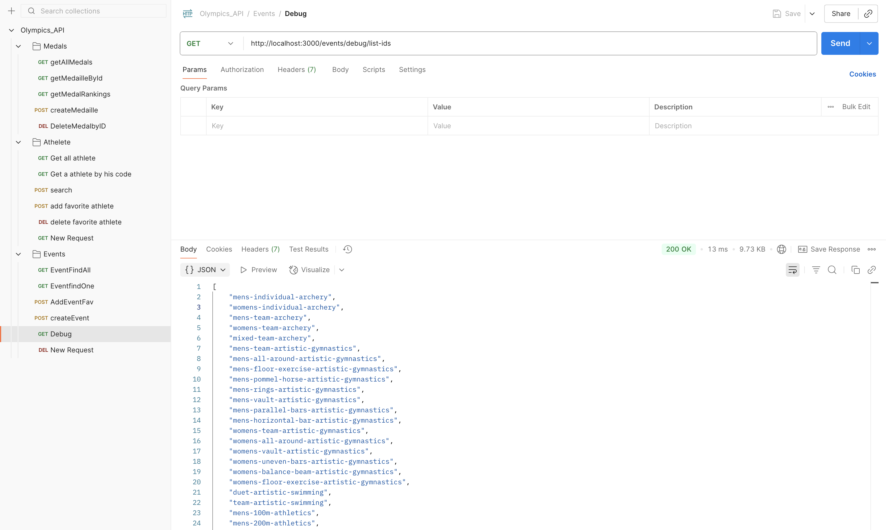
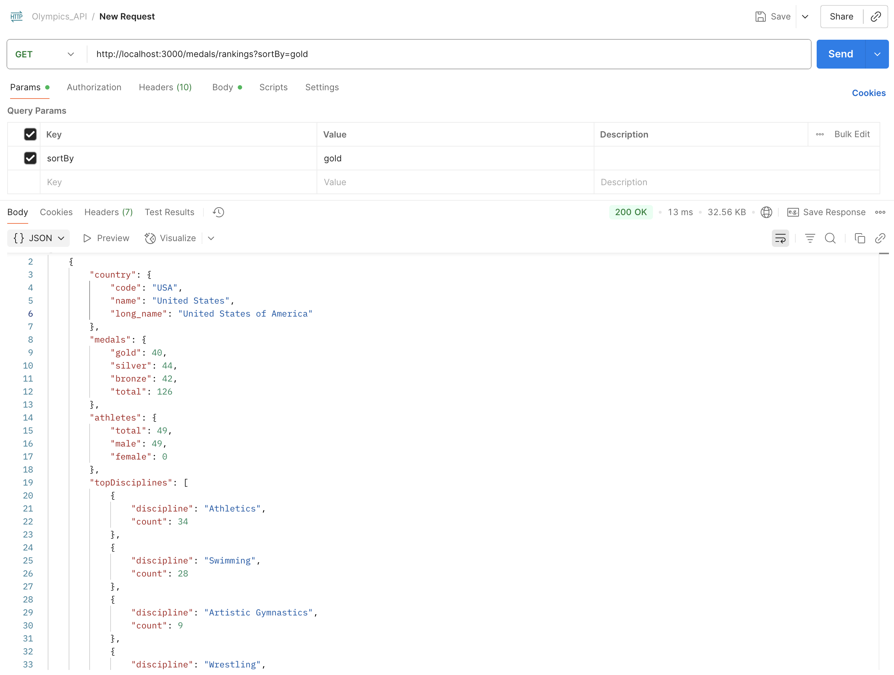
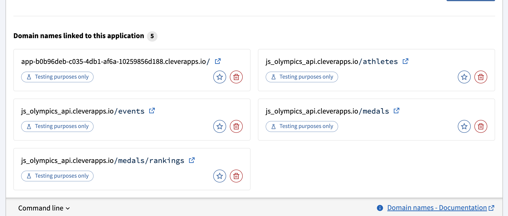
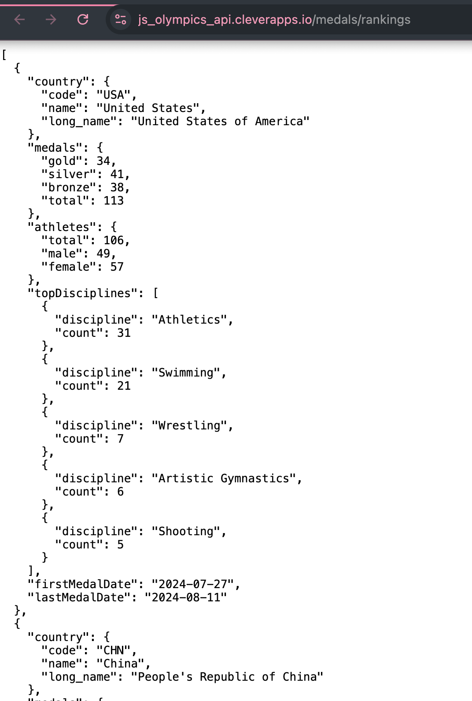
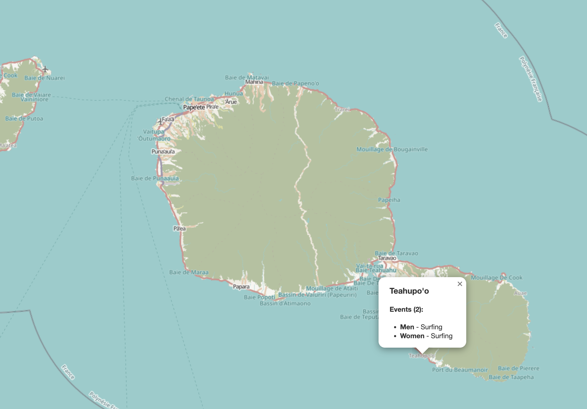

| Titre | 2024_Olympics_API |
|---|---|
| **Description** | NEST JS API deployment project based on Paris 2024 Olympics dataset @ Mines St-Étienne |
| **Auteurs** | Alice Francé, Chloé Larroze |


# JS_Olympics_API Readme

## Sommaire
1. Introduction
2. Arborescence et contexte
3. Quickstart
4. Le projet
   1. Dataset utilisé
   2. API
   3. Configuration
   4. Tests
   5. Déploiement
5. Exemples d'utilisation
6. Bonus
7. Conclusion

## 1. Introduction

En 2024, la France a accueilli l’un des plus grands événements sportifs mondiaux : les Jeux Olympiques d’été de Paris. Pendant plusieurs semaines, des milliers d’athlètes venus des quatre coins du globe se sont affrontés dans plus de 300 épreuves, réparties sur des dizaines de disciplines sportives. Cet événement a également permis  de générer une quantité massive de données : identités des athlètes, pays représentés, performances réalisées, épreuves disputées, palmarès de médailles, etc. Si ces données sont publiquement disponibles, elles sont souvent fragmentées, difficiles à interroger et peu centralisées sous un format accessible pour des développeurs, analystes ou journalistes sportifs qui souhaiteraient les réutiliser.

Dans ce contexte, le Comité d’Organisation des Jeux de Paris 2024 a exprimé un besoin : **concevoir une API regroupant les données clés des JO** afin de faciliter leur consultation et leur exploitation dans d’autres projets (sites web, applications mobiles, visualisations de données, etc.).

<div align="center">
    
    <p><em>Figure 1 : Beach-volley Paris 2024</em></p>
</div>

Nous essaierons ainsi de répondre à la problématique suivante:

> Comment centraliser et rendre accessibles les données massives des Jeux Olympiques de Paris 2024 de manière simple et rapide ?

<!-- --- -->

## 2. Arborescence du projet & contexte

Ce projet a été réalisé dans le cadre d’un TP visant à concevoir une API REST en Node.js avec le framework NestJS. Cette dernière permet d’accéder aux données sous forme JSON et d’effectuer des requêtes sur chacune des entités à travers des endpoints REST.
L’objectif est de manipuler des données issues des Jeux Olympiques d’été de Paris 2024 afin de s’initier à la création d’endpoints, à la structuration d’un projet backend et à la manipulation de fichiers de données.

```bash
├── data
│   ├── csv-2-json.py
│   ├── dataset_csv
│   │   ├── athletes.csv
│   │   ├── events.csv
│   │   ├── medals.csv
│   └── dataset_json
│       ├── athletes.json
│       ├── events.json
│       └── medals.json
├── node_modules
├── package-lock.json
├── package.json
├── README.md
├── src
│   ├── app.module.ts
│   ├── Athlete
│   │   ├── athlete.controller.ts
│   │   ├── athlete.module.ts
│   │   ├── athlete.service.ts
│   │   ├── Athlete.ts
│   │   ├── favorite.controller.ts
│   │   ├── favorite.module.ts
│   │   └── favorite.service.ts
│   ├── Events
│   │   ├── events.controller.ts
│   │   ├── events.module.ts
│   │   ├── events.service.ts
│   │   └── Events.ts
│   ├── main.ts
│   └── Medailles
│       ├── dto
│       │   └── create-medal.dto.ts
│       ├── exceptions
│       │   └── medaille.exception.ts
│       ├── Medaille.ts
│       ├── medailles.controller.ts
│       ├── medailles.module.ts
│       └── medailles.service.ts
├── test
│   ├── athlete.e2e-spec.ts
│   ├── events.e2e-spec.ts.bak
│   └── medailles.e2e-spec.ts
└── tsconfig.json
```

### Cahier des charges

| **Catégorie**         | **Exigence**                                                                                                                                                           | **Suivi / Explications** |
|------------------------|-----------------------------------------------------------------------------------------------------------------------------------------------------------------------|---------------------------|
| **Données OpenData**   | - Les données doivent être en **format JSON**.<br>- Contenir : <br>  • un champ avec l’**URL d’une image** (ou équivalent pour afficher une image dans une liste)<br>  • un champ **latitude/longitude**.<br>- Les données doivent être **chargées dans l’API Nest au démarrage**. | ✔<br><sub>fichiers dans `./data/dataset_json.json` chargés au bootstrap</sub> |
| **API – Endpoints**   | - **Résumé des données** : GET `/beers` → retourne les infos principales (affichage carte + liste + favori ou non).<br>- **Détail d’une donnée** : GET `/beers/:beerId`.<br>- **Mettre à jour favori** : PUT `/beers/:beerId` (avec un body).<br>- **Créer une donnée** : POST `/beers` (avec un body).<br>- **Recherche** : endpoint pour chercher parmi les données. |  ✔<br><sub>(ex : endpoints créés → `/athletes`, `/athletes/:id`, etc.)</sub> |
| **Déploiement**       | - L’API doit être **déployée sur CleverCloud**.                                                                                                                        | ✔<br><sub>URLs CleverCloud :  js_olympics_api.cleverapps.io/athletes, js_olympics_api.cleverapps.io/events et js_olympics_api.cleverapps.io/medals. 
</sub> |
| **Tests**             | - Écrire et exécuter des **tests automatisés** pour valider les fonctionnalités.                                                                                        | ⬜<br><sub>(ex : tests unitaires Jest → `beer.service.spec.ts`)</sub> |
| **Résultats**         | - Garder la possibilité d’**exposer ou afficher les résultats** (par ex. une interface front ou un export JSON accessible publiquement).                                 | ⬜<br><sub>(ex : lien vers le front ou endpoint `/results`)</sub> |


## 3. Quickstart

### 3.1. Prérequis

Avant de commencer, assurez-vous d’avoir :

- Node.js (v18 ou plus récent)
- npm (livré avec Node.js)
- Un compte Clever Cloud pour le déploiement
- (Optionnel) NestJS CLI installé globalement :

```bash
npm install -g @nestjs/cli
```

Cloner le repo puis installer les dépendances du projet

```bash
git clone https://github.com/ChloeLarroze/JS_Olympics_API.git
cd JS_Olympics_API
npm install
```

### 3.2. Lancement de l'application

En local:

```bash
npm run start:dev
```

Pour un build et un démarrage en production :

```bash
npm run build
npm run start:prod
```

### 3.3. Déploiement sur Clever Cloud

- Vérifiez que votre projet contient un fichier `package.json` avec les scripts suivants :
```json
  {
    "scripts": {
      "start": "node dist/main",
      "start:dev": "nest start --watch",
      "build": "nest build"
    }
  }
```

- Connectez-vous à votre compte Clever Cloud : https://console.clever-cloud.com
- Cliquez sur Créer une application → Application Node.js.
- Connectez votre dépôt GitHub (JS_Olympics_API) ou poussez le code sur le dépôt Git fourni par Clever Cloud.
- Ajoutez les variables d'environnement nécessaires (PORT 8080 notamment)
- Poussez votre code sur le dépôt Git Clever Cloud (si vous n’avez pas connecté GitHub directement) :

```bash
git remote add clever <url fournie par clever cloud>
git push clever main 
```

Clever Cloud installera automatiquement les dépendances, lancera npm run build, puis npm start. Une fois l'API lancée, on pourra trouver les endpoints principaux :

- `/athletes`
- `/events`
- `/medailles`

<!-- --- -->
## 4. Notre Projet

### 4.1.  Dataset utilisé

Le dataset utilisé provient de [Paris 2024 Olympic Summer Games Dataset](https://www.kaggle.com/datasets/piterfm/paris-2024-olympic-summer-games).
Il fournit des informations complètes sur les Jeux Olympiques d’été 2024 : athlètes, disciplines, événements, pays participants, et médailles.

Nous utiliserons notamment les tables:


| Fichier        | Description                                                                | Taille           |
| -------------- | -------------------------------------------------------------------------- | ---------------- |
| `athletes.csv` | Informations personnelles sur les athlètes (nom, âge, pays, sport, etc.) | 11 113 athlètes |
| `events.csv`   | Détails sur les épreuves (discipline, type, lieu, participants, etc.)    | 329 épreuves    |
| `medals.csv`   | Détenteurs de médailles (athlète, pays, épreuve, type de médaille)    | 1 044 médailles |

Pour enrichir notre contexte, nous pourrons par exemple imaginer des statistiques, comme montré dans le graphe qui suit, cas d'utilisation auquel notre API pourra répondre:

<div align="center">
    
    <p><em>Figure 2 : Répartition du nombre d'athlètes par pays</em></p>
</div>

#### 4.1.1. Modèles de données JSON générés

À partir de ces fichiers CSV, nous avons ainsi généré des fichiers JSON dans le but de pouvoir utiliser ces données plus facilement (à la fois en terme de lecture que de rapidité d'accès depuis les endpoints). Nous avons pour cela utilisé le programme `csv-2-json.py` présent à titre anecdotique dans le repo.
Les csv comportent de nombreuses informations que nous ne souhaitons pas forcément exploiter pour l'exemple de notre API. Par exemple, `athlete.csv` adopte la structure suivante:


| code    | current | name           | name_short | name_tv        | gender | function | country_code | country | country_long | nationality | nationality_long | nationality_code | height | weight | disciplines   | events                     | birth_date | birth_place | birth_country | residence_place | residence_country | nickname | hobbies | occupation | education | family | lang     | coach | reason | hero | influence | philosophy                                                                               | sporting_relatives                                                                                           | ritual | other_sports |
| ------- | ------- | -------------- | ---------- | -------------- | ------ | -------- | ------------ | ------- | ------------ | ----------- | ---------------- | ---------------- | ------ | ------ | ------------- | -------------------------- | ---------- | ----------- | ------------- | --------------- | ----------------- | -------- | ------- | ---------- | --------- | ------ | -------- | ----- | ------ | ---- | --------- | ---------------------------------------------------------------------------------------- | ------------------------------------------------------------------------------------------------------------ | ------ | ------------ |
| 1532873 | True    | AMOYAN Malkhas | AMOYAN M   | Malkhas AMOYAN | Male   | Athlete  | ARM          | Armenia | Armenia      | Armenia     | Armenia          | ARM              | 0.0    | 0.0    | ['Wrestling'] | ["Men's Greco-Roman 77kg"] | 1999-01-22 | YEREVAN     | Armenia       | YEREVAN         | Armenia           |          |         |            |           |        | Armenian |       |        |      |           | "To become a good athlete, you first have to be a good person." (ankakh.com, 6 Oct 2018) | Uncle, Roman Amoyan (wrestling), 2008 Olympic bronze medallist and two-time European champion in Greco-Roman |        |              |

Nous n'exploiterons cependant pas toutes ces données dans notre API mais ces dernières sont toujours ajoutables. Ainsi, nous structurerons les données de `athlete` dans la structure suivante (fichier `Athlete.ts`).

```json
{
    "code": 123456,
    "name": "John Doe",
    "gender": "Male",
    "nationality": {
      "name": "USA"
    },
    "country": {
      "code": "USA",
      "name": "United States"
    },
    "disciplines": ["100m", "200m"],
    "events": ["Summer Olympics 2020"],
    "Physical_attributes": {
      "weights": 75,
      "height": 180
    }
  }  

```

#### 4.1.2. Qualité de la donnée, remarques et problèmes

Comme dans tous les datasets, une petite phase de nettoyage a été nécessaire avant la conversion en JSON et la pleine exploitation des données. Nous avons pu observer :

- une présence de valeurs `NaN` à de nombreux endroits, il faudra les remplacer par des `null`pour la fonction de parsage.
- dans les genres des athlètes: les équipes mixtes sont marquées comme 'X'. Il faudra y faire attention lors de l'exploitation, par exemple du nombre de médailles remportées par des hommes par tel pays, etc.
- certains events ou athlètes n'apparaissent pas dans la liste des médailles
- Ex. Gregoria Mariska TUNJUNG a un type "Bronze Medal" mais pas de medal_code (devrait être 3) (l.471 de medals.csv)

<!-- --- -->

### 4.2. API

#### 4.2.1. Architecture générale

L’API développée suit l’architecture *RESTful*, ce qui signifie que chaque ressource (athlètes, événements, médailles, favoris) est accessible via une URL unique et manipulée grâce aux méthodes standard du protocole HTTP. On pourra notamment citer les principales:

- GET : lecture d’une ou plusieurs ressources
- POST : création d’une nouvelle ressource
- PUT / PATCH : mise à jour partielle ou complète d’une ressource
- DELETE : suppression d’une ressource

Toutes les données échangées entre le client et le serveur transitent au format JSON, format relativement léger mais surtout très largement utilisé pour les API. Chaque requête reçoit en retour une réponse "structurée" contenant les informations demandées ou un message de statut (succès, erreur, etc.). Le projet est construit avec NestJS, qui repose sur une architecture modulaire. En effet, le **AppModule** encapsule les trois modules principaux (`Athletes`, `Events`, `Medals`) ainsi que le module `Favorites`. Dans chaque module, on retrouve un Controller (responsable de définir les routes/endpoints) et un Service (chargé de l'implémentation de la logique (comme la recherche, la création ou la suppression de données, etc)), illustré dans le schéma suivant :

<div align="center">
    
    <p><em>Figure 3 : Schéma API</em></p>
</div>

<!-- TODO : check for figure numbering -->

#### 4.2.2. Liste des endpoints

##### Athlètes (/athletes)

* GET /athletes - Liste tous les athlètes.
* GET /athletes/:code?code=... - Détails d'un athlète recherché par son code.
* POST /athlete/search - Détails d'un ou des athlètes recherchés par une information (ex: prénom, pays, nom).
* GET /favorites?user=... - Liste des athlètes favories d'un user.
* POST /favorites/add/...?user=... - Ajouter un athlète dans les favories d'un user.
* DELETE /favorites/remove/...?user=... - Retirer un athlète des favories d'un user.

##### Événements (/events)

- GET /events : liste tous les événements (avec possibilité de filtrer par pays via ?country=...).
- GET /events/:id : détail d’un événement spécifique.
- POST /events : création d’un nouvel événement.
- DELETE /events/:id : suppression d’un événement.
- POST /events/favorite/:id : met un événement en favori.
- GET /events/debug/list-ids : endpoint de debug listant les identifiants disponibles.

##### Médailles (/medals)

- GET /medals : liste l’ensemble des médailles.
- GET /medals/rankings?sortBy=... : retourne le classement des pays selon un critère (total, gold, silver, bronze).
- GET /medals/:id : détail d’une médaille identifiée par son ID (souvent lié au code d’un athlète).
- POST /medals : création d’une nouvelle médaille.
- DELETE /medals/:id : suppression d’une médaille existante.


#### 4.2.3. Exemple de réponse JSON

Pour la requête suivante :

```vbnet
GET /events/Women's Individual-archery
```

> Note: Nous avons ajouté un nettoyage du texte entré dans la requête. Ainsi, seront pris en charge les cas suivants: 
> - "Women's Individual-archery"
> -  "Womens individual archery"
> -  "womens-individual-archery" (la version "normalisée")

On s'attend à recevoir :

```json
{
    "event": "Women's Individual",
    "tag": "archery",
    "sport": {
        "name": "Archery",
        "code": "ARC",
        "url": "https://olympics.com/en/paris-2024/sports/archery"
    },
    "discipline": "Archery",
    "event_type": "Individual",
    "url_event": "/events/arc/women's-individual",
    "locations": [
        {
            "venue": "Esplanade des Invalides",
            "lat": 48.8584337,
            "lng": 2.3138998
        }
    ]
}
```

### 4.3. Configuration
#### 4.3.1.  Généralités
Notre application utilise des variables d’environnement pour rester flexible entre pahse de dev et de prod (notion que nous avons pu découvrir lors de l'un de nos stages).  Ici, la principale variable attendue est le `PORT` (port d'écoute de l'API) mais nous aurions aussi pu ajouter une variable définissant la phase de développement (par ex. `NODE_ENV`). 

Actuellement, l’API utilise uniquement des données JSON chargées au démarrage, mais nous pourrions ajouter une connection vers une DB (implique de gérer les credentials, la persistance, etc). 

Enfin, pour permettre l’accès depuis un front-end ou d’autres clients, ce que nous traiterons en bonus, il est nécessaire d’activer les CORS :  

```typescript
// ./src/main.ts
const app = await NestFactory.create(AppModule, { cors: true });
```

#### 4.3.2.  Gestion des erreurs

NestJS centralise les exceptions grâce au système d’Exception Filters.
Dans notre implémentation actuelle :

- Par défaut, un throw new Error('Event not found') est traduit en 500 Internal Server Error, nous nous en contenterons pour l'instant. 
- Si notre API est lancée en prod, il serait préférable d’utiliser les classes natives (NotFoundException, BadRequestException) pour obtenir des statuts d'erreurs plus précis (404, 400, etc.).

<!-- --- -->

### 4.4. Tests

#### 4.4.1. Structure et exécution des tests

Les tests sont organisés en deux catégories principales :

- Tests unitaires : validation isolée de la logique métier (services).
- Tests d’intégration (aka e2e) : vérification des contrôleurs et de la chaîne complète requête → réponse, à l’aide de Supertest et du framework de test de NestJS. On retrouvera l'arborescence suivante:

```bash
/test
  ├── events.e2e-spec.ts
  ├── medals.e2e-spec.ts
  └── athlete.e2e-spec.ts
```

Par ailleurs, les tests sont exécutés via Jest (par défaut avec NestJS) :

```bash
npm run test         #execution des tests unitaires
npm run test:e2e     #exécution des tests end2end
npm run test:cov     #execution avec la couverture
```

> Note: Nous avons mis en place une vérification du bon format de médaille lors de la création "manuelle" d'une nouvelle médaille (requête @Post()) avec un objet DTO. Il faut pour cela disposer des packages nécessaires class-validator et class-transformer.

#### 4.4.2. Couverture de code

La couverture de code est générée automatiquement avec Jest (commande ci-dessus) et peut être consultée dans le dossier /coverage, ici non inclus dans le repo. Cette dernière permet de visualiser les parties de nos code couvertes par des tests et celles qui nécessitent encore de nouveaux scénarios.

```zsh
----------------------------|---------|----------|---------|---------|------------------------
File                        | % Stmts | % Branch | % Funcs | % Lines | Uncovered Line #s  
----------------------------|---------|----------|---------|---------|------------------------
All files                   |   19.13 |     6.79 |   22.44 |   19.59 |                              
 src                        |       0 |        0 |       0 |       0 |                  
  app.module.ts             |       0 |      100 |     100 |       0 | 3-13             
  main.ts                   |       0 |        0 |       0 |       0 | 1-16             
 src/Athlete                |   47.61 |    61.11 |   66.66 |   48.35 |                  
  athlete.controller.ts     |       0 |      100 |       0 |       0 | 1-21             
  athlete.module.ts         |       0 |      100 |     100 |       0 | 1-11             
  athlete.service.ts        |   89.28 |       50 |    90.9 |      88 | 22,43,53         
  favorite.controller.ts    |       0 |      100 |       0 |       0 | 1-37             
  favorite.module.ts        |       0 |      100 |     100 |       0 | 1-11             
  favorite.service.ts       |   89.28 |    66.66 |     100 |      88 | 17,39-40         
 src/Events                 |   33.33 |        0 |   26.31 |   28.57 |                  
  events.controller.ts      |   88.88 |      100 |   71.42 |    87.5 | 42,48            
  events.module.ts          |     100 |      100 |     100 |     100 |                  
  events.service.ts         |      10 |        0 |       0 |    7.01 | 11-150           
 src/Medailles              |   82.72 |       75 |   72.41 |   83.15 |                  
  medailles.controller.ts   |   81.25 |      100 |      50 |   78.57 | 30,36,43         
  medailles.module.ts       |     100 |      100 |     100 |     100 |                  
  medailles.service.ts      |   81.81 |    74.28 |   78.26 |   83.11 | 28,38-39,47-49,144-158 
----------------------------|---------|----------|---------|---------|------------------------

Test Suites: 3 passed, 3 total
Tests:       25 passed, 25 total
Snapshots:   0 total
Time:        16.573 s
```

#### 4.4.3.  Postman

Nous avons également créé un workspace Postman pour tester manuellement notre API et partager les collections de requêtes  [Workspace Postman JO Paris 2024](https://joparis2024.postman.co/workspace/JO_Paris2024-Workspace~b3d123fe-cfd9-46a1-85b7-b215b58cba47/collection/46131293-f678c346-5ec0-457d-8687-e63590c39d2f?action=share&creator=46131293). Il regroupe notamment les appels aux différents endpoints (/events, /athletes, /favorites, /medals) avec paramètres, exemples de payloads JSON et scénarios de test.

<div align="center">
    
    <p><em>Figure 4 : Collection Postman JO Paris 2024</em></p>
</div>

Par exemple, nous avons un test fonctionnel pour le endpoint `Medal`:

<div align="center">
    
    <p><em>Figure 5: Query Postman Medal</em></p>
</div>

### 4.5. Déploiement

#### 4.5.1. Configuration Clever Cloud

L’application est déployée sur Clever Cloud, une plateforme PaaS qui simplifie l’hébergement des applications Node.js. La configuration inclut dans notre cas un lien automatique avec le dépôt GitHub pour déclencher les déploiements. Concernant le déploiement, un pipeline CI/CD (par exemple GitHub Actions) s'assure que les tests (aussi bien unitaires et e2e) passent avant le déploiement, que le build soit généré (npm run build). Enfin, si tout est vert, il déclenche le déploiement automatique.

#### 4.5.2. Résultats

<div style="display: flex; justify-content: space-around;">
  <div style="text-align: center;">
    
    <p>Figure 6 : Différents noms de domaines des endpoints</p>
  </div>
  <div style="text-align: center;">
    
    <p>Figure 7 : Résultat dans un browser</p>
  </div>
</div>

<!-- --- -->

## 5.  Exemples d'Utilisation

- Un utilisateur consulte la liste des événements disponibles et en ajoute certains en favoris.
- Le comité de suivi accède au classement des médailles par pays, trié par nombre d’or.
- L’application mobile affiche la liste des athlètes favoris d’un utilisateur, persistée via l’API.

## 6. Bonus 

### 6.1. DTO 
Un DTO est une classe utilisée pour transférer des données entre différentes couches d'une application (par exemple, entre le frontend et le backend, ou comme dans notre cas, entre le contrôleur et le service).
Son objectif principal est de structurer les données et de définir clairement les propriétés attendues lors de la création ou la modification d'une ressource. Dans le cas de notre `CreateMedalDto`, ce DTO sert à recevoir et valider les informations nécessaires pour créer une médaille, incluant la médaille elle-même, la date, l'athlète, l'événement et le pays.

Il y a ainsi quelques points auxquels il faudra prêter attention, tels que la vérification que les décorateurs (@Type, @IsDateString, @IsNotEmpty, etc) et les classes (MedalDto, AthleteDto, EventDto, CountryDto) sont bien importés en haut du fichier.

### 6.2. Front
Pour ajouter un interêt à la nécessité de devoir disposer de coordonnées, nous avons créé une interface en front, dont le code est largement <s>piqué</s> inspiré de [Leaflet-examples](https://github.com/tomickigrzegorz/leaflet-examples), nous les avons ensuite modifiés pour qu'ils correspondent à nos données. 

<div align="center">
    
    <p><em>Figure 8 : Front app de base (Leaflet)</em></p>
</div>

L'interface récupère automatiquement les données depuis l'endpoint /events de l'API et affiche un marqueur pour chaque lieu olympique. Chaque marqueur est cliquable et affiche une popup avec le nom du site, la liste des épreuves qui s'y sont déroulées. 

Par ailleirs, les sites qui accueillent plusieurs épreuves sont regroupés sous un seul marqueur pour éviter la surcharge de la carte.

L'implémentation se base donc sur :
- Leaflet.js : bibliothèque JavaScript open-source pour les cartes interactives
- OpenStreetMap : fond de carte libre et collaborative
- HTML/CSS/JavaScript vanilla : car pas besoin de framework 

Il ne faut pas oublier d'acriver les CORS dans le main. 

Il y a malheurseusement dans notre dataset des coordonnées invalides, on ne les regardera pas (sinon erreur). 

## Conclusion

Ce projet nous a permis de découvrir et de mettre en pratique le développement d’une API RESTful complète avec NestJS, depuis la structuration des données jusqu’au déploiement sur Clever Cloud.  
Nous avons pu manipuler un dataset assez riche, mais surtout réaliste (JO Paris 2024), en créant des endpoints permettant d’interroger, filtrer et enrichir ces données.  
Au-delà de l’aspect technique, ce travail nous a aussi familiarisées avec de bonnes pratiques de développement : modularité, séparation des responsabilités, tests automatisés et configuration adaptée aux différents environnements.

Ce projet constitue donc une bonne base pour aller plus loin, aussi bien du point de vue des fonctionnalités que de l’architecture. 

### Pistes d'amélioration

- **Couverture des tests** : au vu de la couverture actuelle, enrichir les scénarios unitaires et e2e pour renforcer notre code. 
- **Front-end** : un front a déjà été développé, il pourra être amélioré et connecté de manière fluide à l’API/ à une DB pour proposer une meilleure interface.  
- **Persistance des données** : connecter l’API à une véritable base de données (ex. PostgreSQL, MongoDB). 
- **.env et configuration** : rationaliser le fichier `.env` pour n’y laisser que les variables essentielles (ex. clés API éventuelles).  
- **Nouveaux endpoints** : implémenter des routes plus avancées, comme des statistiques détaillées par discipline/pays, etc.  


